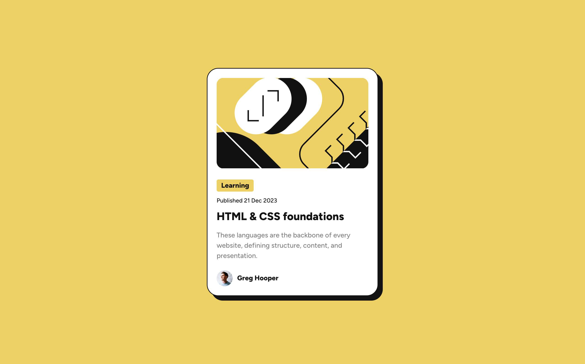
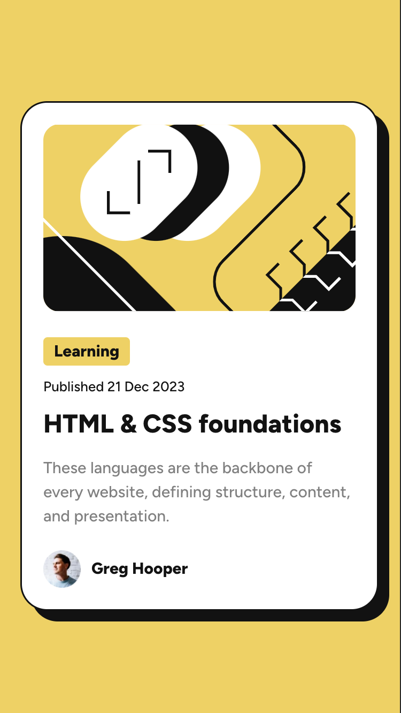

# Frontend Mentor - Blog preview card solution

This is a solution to the [Blog preview card challenge on Frontend Mentor](https://www.frontendmentor.io/challenges/blog-preview-card-ckPaj01IcS)

## Table of contents

- [The challenge](#the-challenge)
- [Screenshot](#screenshot)
- [Links](#links)
- [Built with](#built-with)
- [What I learned](#what-i-learned)
- [Continued development](#continued-development)
- [Author](#author)
- [Acknowledgments](#acknowledgments)

**Note: Delete this note and update the table of contents based on what sections you keep.**

### The challenge

Users should be able to:

- See hover and focus states for all interactive elements on the page

### Screenshot





### Links

- [Solution URL](https://github.com/knebula/blog-preview-card)
- [Live Site](https://knebula.github.io/blog-preview-card/)

### Built with

- CSS custom properties
- Flexbox
- CSS Grid
- Mobile-first workflow

### What I learned

I learned how to use css grid on the body tag to center my card on the page.

```css
body {
  min-height: 100vh;
  display: grid;
  place-content: center;
}
```

### Continued development

I struggled with adding margins to the card elements, so that will be something i will work on.

## Author

- knebula

## Acknowledgments

Kevin Powell on YouTube has been a huge help.
